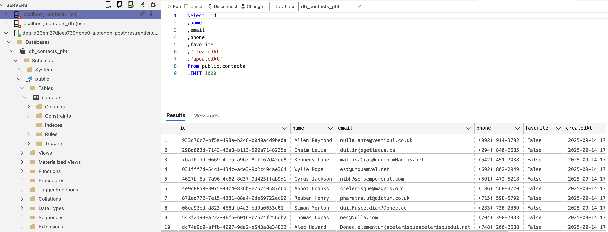

# goit-node-rest-api

## HW 3 Postgress

### Results:

Seed initial contact (optional): 

```bash
node seed/contacts.js

Database connection successful
Contacts seeded successfully
```

#### Step 2 Result:



#### Step 3 Result:

Create connection to PosgresSQL with Sequelize:
```bash
npm start            

> start
> node ./app.js

Database connection successful
Server is running. Use our API on port: 3000
```

Connection error handling:

```bash
npm start

> start
> node ./app.js

Database connection error: password authentication failed for user "db_contacts_pbtr_use"
```

CRUD-operations with Sequelize:

```bash
npm start

> start
> node ./app.js

Database connection successful
Server is running. Use our API on port: 3000
GET /api/contacts 200 2229 - 1457.680 ms
GET /api/contacts/8057fedf-7afc-4834-90bc-9020c2c0157b 200 224 - 1422.516 ms
DELETE /api/contacts/8057fedf-7afc-4834-90bc-9020c2c0157b 200 224 - 391.191 ms
# delete for already deleted (not existed contact)
DELETE /api/contacts/8057fedf-7afc-4834-90bc-9020c2c0157b 404 23 - 285.806 ms 
# get for already deleted (not existed contact)
GET /api/contacts/8057fedf-7afc-4834-90bc-9020c2c0157b 404 23 - 197.998 ms
POST /api/contacts 201 214 - 1423.955 ms
# check for validation
POST /api/contacts 400 38 - 3.433 ms
POST /api/contacts 201 218 - 1579.806 ms
GET /api/contacts/6ed2573a-4cc7-42c3-901a-e221ebd302b3 200 218 - 1579.280 ms
PUT /api/contacts/6ed2573a-4cc7-42c3-901a-e221ebd302b3 200 218 - 382.027 ms
PATCH /api/contacts/6ed2573a-4cc7-42c3-901a-e221ebd302b3/favorite 200 218 - 396.783 ms
```

#### Step 4 Results:

- The logs from working API endpoint in in previous section log.
- [Route update](./routes/contactsRouter.js?l=25)
- [Controller update](./controllers/contactsControllers.js?line=63)
- [Service update](./services/contactsServices.js?line=32)